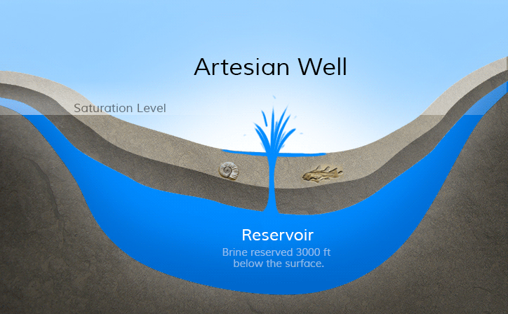
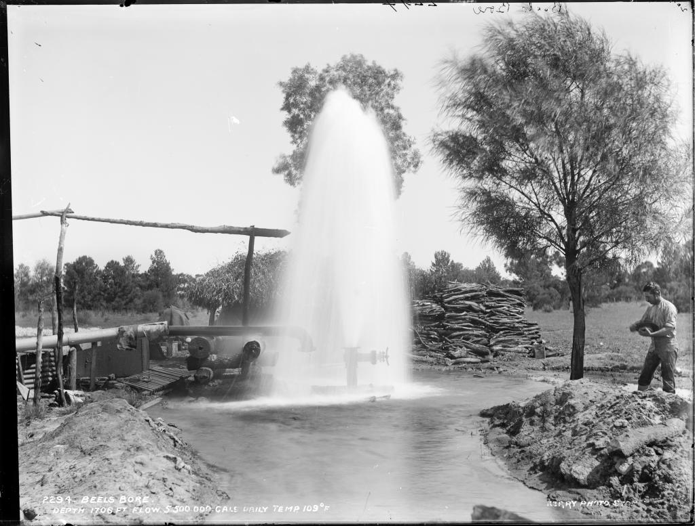

# John 4 Study Notes

# Who

Jesus
: a man
: a Jew
: a teacher
: a percieved prophet
: the Son Of God
: giver of living water
: the perfect
: greater than Jacob

Samaritan Woman
: fetches water in the evening (to avoid others?)
: a Samaritan
: a woman
: thirsty - physically
: divorced 5 times (thirsty spiritually and emotionally)
: husbandless
: the person being shared the Gospel to

"husbands"
: divorced woman 5 times
: living with out of wedlock

Men of City
: trusted her word

# What 

## Happended

An awkward conversation
A life intervention
A Gospel presentation
A people coming under salvation

## Conversation

### Leading Question 1: "Give me a drink"

* Socially wrong to be talking to a woman, a Samaritain, a sinner

Purpose: 
* Start a conversation
* Grab attention

Response: what are you doing?

### "If you knew"

* the gift of God?
* who is talking to you
* He would have given you living water

2 important verbs: _ask_ and _give_

Response: 

* "where then do You get than living water?" - where is the gift coming from?
* "You are not greater than Jacob, are you?" - what are your credentials? who are you?

### "Everyone ever drinks"

Purpose: 
* show that everything from this earth will make you thirst.

Examples: 
  * sex
  * relationships from a boyfriend/girlfriend
  * social media
  * uncontrolled spending - material or immaterial
  * good experiences
  * food

Compare to a well of water springing up to eternal life

### "Woman, believe me"

# When 

# Where

Jerusalem or Mount Gerizim

# Why

# How

# External links

[NET Translation](https://netbible.org/bible/John+4)

# Interpretation

# Application

## Who Were witnessed to

* Jesus witnessed to everyone - regardless of who they are
