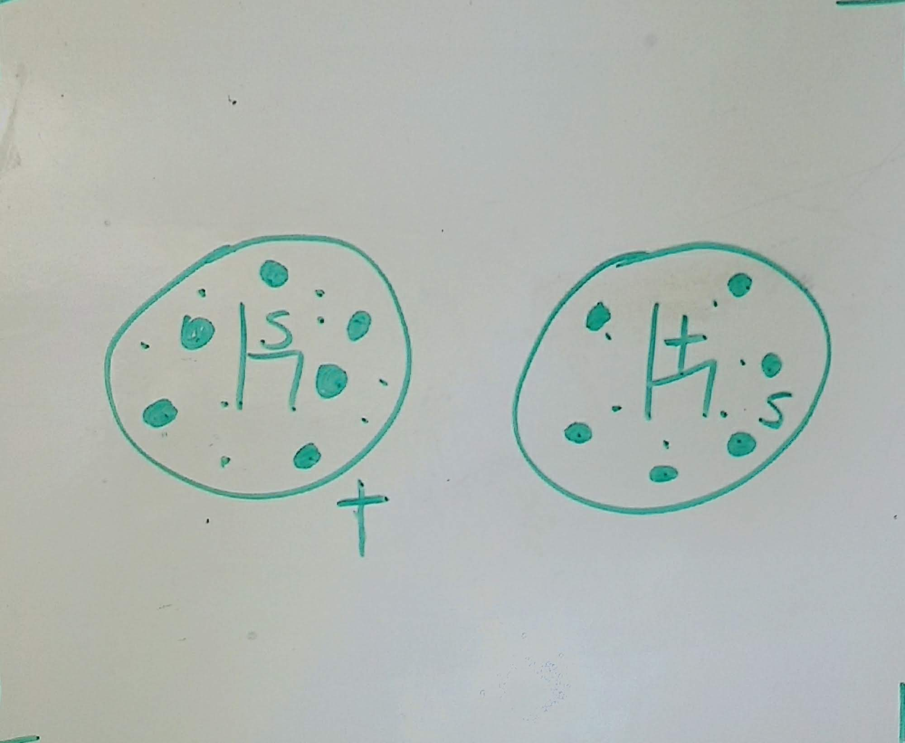

% The 4 Spiritual Laws and Sharing The Gospel

# Intro

Matthew 28:19

* Learning about who Jesus was in the OT, NT
* Learning what Jesus did

Now we get to learning how to share Jesus with others.

* There is no 

# Law 1 

v10 - "livng water"

__God loves you and has a wonderful plan for your life.__

## Love

John 3:16

1 John 3:16

_HOT DOG!_ This is amazing isn't it?!

When was the last time you knew deep down that someone would lay their life
down for you?

It's hard to grasp in your heart what this love really means until you get to
know the person who loves you.

* Before you can share the Gospel with someone you must first know who you're
talking about?

I wonder do you know Him?  Have you tasted of His "living water?"

## Plan

When God created you He didn't just make you and then left your life to 
be carried out on your own.

_Eph 1:4_

From God's perspective your story began before time existed.

> God, as Creator, formed man, to be a vessel in which He could show forth His
> power and goodness. Man was not to have in himself a fountain of life, or
> strength, or happiness: the ever-living and only living One was each moment
> to be the Communicator to him of all that he needed.
> - _Waiting On God_, Andrew Murray

In otherwords:
* Man was created by God to bring Him glory
* God intented all of life to be enjoyed and reliant on Him.

_Eph 2:10_

# Law 2

v11 - v14

If God created us with such an immense capacity of life why aren't some of us 
experiencing this? 

Why do we not have a constant "living water" welling up within us?

This brings us to our 2nd Law

__Man is sinful and is seperated from God.__

v11 

Here's a picture of a deep well.

Jesus Himself is speaking in a metaphor in v13.

If you try and live by your own well you will keep thirsting?

How do you think that Jesus got the living water?

_Write down what you think the difference is between the two wells are_?

One is man-powered. The other isn't! 

Without God we can do nothing! We are spiritually dead.

_Romans 5:12_

When we are born we are born with a nature completely seperated from God. This
is what "death" means: Seperated.

_Romans 3:23_ says "For all have sinned and fallen short of the glory of God!"

Today we try and draw from our own wells thinking that we can reach God, or
worse, live without Him!

_Write down some ways we try and live without God or reach Him by our own
efforts._

v15 - v18

In the Jewish culture of the day a woman could not divorce a man - she was
divorced by her husband.

This woman had been divorced, rejected 5 times! And is now to 

Let's be careful to not thrown stones at her! This woman represents many of us!

If you have ever tried to escape the pains of life by running to anything or
anyone but God then you and this woman are a lot alike!

Notice when she went to the well - 6 in the evening! She was hiding from others
because of her shame.

Since I was a child I battled with a very low self-image because of the kind of
home I grew up in. 

There are times in my life where I battle with dark and severe moments.

We each have a God shaped hole in our hearts.

# Law 3 

v19 - v26

So how do we restore the relationship with God? We don't - God already did.

__Jesus is God's only provision for man's sin__

1. He died

_Romans 5:8_ 

2. He rose from the grave

_1 Corinthians 15:3-6_

Today there is a common misonception that as long as we're a "good person"
we'll get to heaven!

3. He is the ONLY Way

_John 14:6_
_Romans 10:9_

Note this is not "believe and: "
* be baptized
* stop committing adultery
* go to Church
* read your Bible!

No where in this passage did Jesus require the woman to get her act together
before she accepted the Free Gift of God!

# Law 4

Head knowledge only goes so far.

The fourth spiritual law is:

__We must individually recieve Jesus Christ as Savior and Lord__

v28a

"So the woman left her waterpot"

Stop here. THere is some huge imagery here!

Will you, like this woman, leave your bucket. Leave your striving, and deep
empty well and accept the free Gift God is Giving you?

Remember the "gift" from v10?

_Ephesians 2:8-9_

# Application

