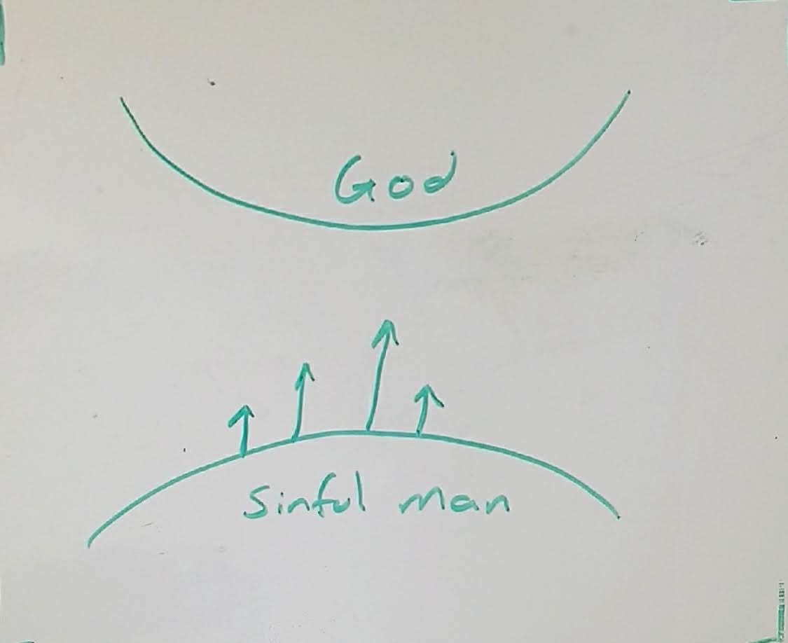

% Sharing the Gospel - Tuesday night worship

# Share the Gospel

# Key Scripture

* 1 Cor 15:3-6
* 2 Thess 1:8,9
* Eph 2:1-10
* Jn 14:6
* Jn 1:12
* Jn 3:1-8 (possible passage to use? - include vv9-21)
* Jn 3:16
* Jn 17:3
* Rev 3:20
* Rom 3:22, 6:23
* Rom 5:8

## 4 Spiritual Laws

### God loves us and He has a wonderful plan for your life.

John 4 woman at the well?

_John 10:10_

Abundantly
* Rom 5:13-21
* Heb 6:17, 7:25
* 2 Peter 1:11

What is the abundant life?

"abundant"
: perisos

### Man is sinful and is seperated from God.

Remember that this is can be sore subject for most people and that they will
not like to hear this.

_Romans 3:23_

* God cannot have a relationship with someone who is sinfull

1. The punishment for sin is death - spiritual death (Genesis 2:17)

1. Death means seperation and therefore we are separated from God

### Jesus is God's only provision for man's sin

_Romans 5:8_

_1 Corinthians 15:3-6_

_John 14:6_

Who Christ is?

Passage       Meaning
---------     ---------
John 3:17     The Son of God
John 4:13-14  Living Water
John 6:33,51  The bread of life
John 10:10    The Good Shepherd to give abundant life
John 12:47    The savior of the world

### We must individually recieve Jesus Christ as Savior and Lord

_John 1:12_
_Ephesians 2:8-9_
_John 3:1-8_
_Revelation 3:20_

# How To Share the Gospel

## What attitude should I share with?

## Am I sharing enough?

## What if they come to Christ?

## Examples from personal life

* naturally talking of Christ while at GTRI
* sharing the attitude of Christ on the cross.
* Use your natural gifting

2 Peter 3:8-9

## Guards Against Legalism

* We are to obey the Great Commandment however it must be done under the
  freedom we have in Christ, not with a legalistic heart.
* Your fulfillment of the Great Commandment does _not_ change your position in
  Christ. You cannot say "I am not saved" because I don't witness as often as I
  should.
* Be careful of Satan's lies that will try and condemn you by saying you are a
  terrible Christian because you don't share Christ with every person you meet.
  It is easy for us to take standards and put them well above where God
  intended. While He wants us to obey we must be careful about doing so with
  the correct attitude otherwise we risk the authenticity of the Gospel.
* Share what God has done in your life - pray and ask that He would bring them
  to your mind. Keep a journal of what He has done and share that with others.
  A common pattern in the Gospels is how Christ would change a person's life
  and they would go and tell others what Christ has done (see woman at the well
  John 4)

## What has the Lord been teaching me recently?

* It is not about what I've done, or what I cannot do. But about what God sees
  I am becoming.
* Humility means admitting what you don't know and taking a true assesment of
  who you are.
* Forgiveness is the door to healing
